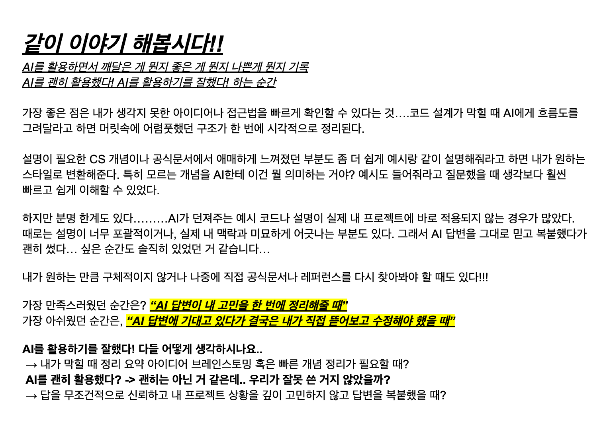

### 나온 아이디어

1. (강한 멘탈은 강한 육체에서!!) 체크리스트를 작성해서 자기한테 맞는 운동 추천받기 \*\*
2. ~~스트레스 관리할 수 있는 체크리스트를 추천해달라하기~~
3. 디지털 디톡스 방법 추천받기\*\*
4. ~~내가 오늘 한 질문을 바탕으로 학습피드백을 해줘(긍정적으로, 칭찬 필수)\*~~
5. 소확행 추천받기 \*\*
6. 평이한 일기를 쓰면 감사 포인트를 짚어줘서 감사일기로 변환해주기\*

---

# 퀘스트

# 1.체크리스트를 작성해서 자기한테 맞는 운동 추천받기

-   배경
    -   강한 멘탈은 강한 육체에서 나온다!
-   목적
    -   단순히 “재밌어 보이는 운동”이 아니라, **목적, 성격, 체력, 생활패턴** 등 자신의 특성을 분석해 **과학적으로 적합한 운동을 찾는 것**을 목표로 한다.
-   수행 방법
      

      - 체크리스트
      

          ### 1. **운동 목적**
          
          - [ ]  **체중 감량**이 주목적인가?
          - [ ]  **근력 강화**(근육량 증가, 체형 개선)가 주목적인가?
          - [ ]  **심폐 지구력**(달리기, 마라톤, 전신 지구력)이 필요한가?
          - [ ]  **유연성 향상**(스트레칭, 요가)이 주목적인가?
          - [ ]  **스트레스 해소 / 재미**가 우선인가?
          - [ ]  **사교 활동**(사람들과 어울리는 것)이 중요한가?
          
          ---
          
          ### 2. **운동 환경 선호**
          
          - [ ]  **실내** vs **야외** 중 어디가 더 편안한가?
          - [ ]  **혼자** 하는 것을 선호하는가, 아니면 **여럿이** 하는 것이 좋은가?
          - [ ]  **집에서** 할 수 있어야 하는가, **헬스장·센터**를 이용해도 괜찮은가?
          - [ ]  **장비**를 사용하는 것을 좋아하는가, 아니면 **맨몸 운동**이 좋은가?
          
          ---
          
          ### 3. **운동 강도와 시간**
          
          - [ ]  강도가 높은 운동(예: 크로스핏, 복싱)을 할 **체력과 의지가 충분**한가?
          - [ ]  **짧고 강한 운동**(20~30분 HIIT)과 **길고 느긋한 운동**(1시간 이상 걷기, 요가) 중 어느 쪽이 적합한가?
          - [ ]  **매일** 할 수 있는지, **주 2~3회** 정도가 적당한지?
          
          ---
          
          ### 4. **성격 및 취향**
          
          - [ ]  경쟁을 좋아하는가? (**배드민턴, 테니스, 격투기** 등)
          - [ ]  리듬이나 음악과 함께하는 것을 좋아하는가? (**댄스, 줌바, 에어로빅** 등)
          - [ ]  집중력을 요하는 운동이 좋은가? (**클라이밍, 필라테스**)
          - [ ]  새로운 기술을 배우는 걸 즐기는가? (**수영, 무술**)
          
          ---
          
          ### 5. **건강 상태**
          
          - [ ]  무릎, 허리 등 **관절에 부담이 적은 운동**이 필요한가?
          - [ ]  이전에 운동 부상 경험이 있는가?
          - [ ]  의사나 전문가가 추천하는 운동이 따로 있는가?
          
          ---
          
          ### 6. **장기적 지속 가능성**
          
          - [ ]  **비용**이 크게 부담되지 않는가? (헬스장, PT, 장비 구매 고려)
          - [ ]  **꾸준히 할 수 있는 재미**가 있는가?
          - [ ]  시즌, 날씨와 상관없이 할 수 있는가?

-   달성기준
    운동을 하지 않아도 됩니다!! 운동하는 상상만으로도 일정 부분 운동 효과가 있다고합니다
    체크리스트를 통해 추천 받은 운동을 유튜브로 보고 내가 하는 상상을 해보는건 어떨까요?

# 2. 디지털 디톡스 방법 추천받기

-   배경 : AI에게 멘탈 케어를 받는 것은 좋으나, 가끔은 그의 가식적인 멘트가 보기 싫은 날이 있을 것이다.
    > 미국과 캐나다 공동연구진은 단 2주 동안 모바일 인터넷 접속을 끊은 것만으로도 정신 건강과 집중력이 크게 개선되는 것으로 나타났다고 국제학술지 ‘국립과학원회보 넥서스’(PNAS Nexus)에 발표했다. 이처럼, 전자기기를 멀리하는 것만으로도 정신 건강에 크게 도움이 됨을 알 수 있다. 하루에 몇시간씩 컴퓨터를 필수로 접해야 하는 캠퍼들에게 꼭 필요한 디톡스일 것이다.
-   목적 : 전자기기 없이 쉬는 시간 보내기. 미션을 진행하느라 쉬는 시간이 없다고 느끼겠지만, 뇌에게 쉬는시간을 보장하기 위함.
-   달성 기준
    -   [ ] 자거나, 식사하는 것 제외하고 '어떠한 활동'을 하였는가
    -   [ ] 인증용 사진을 #random에 최소 1일 공유하기
    -   [ ] 디톡스 방법을 공유하고 소감을 weekN.md에 작성하기

# 3. 소확행 추천받기

-   배경
    -   하루하루 반복되는 바쁜 부스트캠프 미션, 개발 공부, 과제 등으로 인해 일상 속 작은 즐거움을 놓치기 쉽다. 이에 따라, ai에게 소위 \***\*작지만 확실한 행복(소확행)\*\***을 추천받고 실천함으로써, 일상의 리듬에 긍정적 에너지를 불어넣어 준다.
-   목적
    -   개발자 성장 과정 속에서 마음의 여유와 밸런스를 유지하기 위함- 새로운 소확행 아이디어를 외부에서 수혈받아 습관처럼 실천하기 위함, 정신적 번아웃을 방지하고, 꾸준한 몰입을 위한 감정 리프레시 유도
-   달성 기준
    -   하루에 1회 이상 AI에게 소확행 아이디어를 추천받기(예: “딸기우유 마시기”, “5분간 창밖 보기”, “좋아하는 음악 한 곡 정해서 집중해서 듣기”)- 받은 소확행 중 적어도 1개를 그날 실천해서 일기나 노션에 기록하기    - 추천 리스트가 너무 어렵다면, 자신이 가능한 수준으로 조정 가능

# 4. AI로 쓰는 감사일기

-   배경
    -   시간적/체력적 여유가 없으면 사소한 일에 감사하기 힘들고, 감사한 일이 없으면 행복감이 줄어든다고 생각했다. 오늘 놓치고 간 감사한 일들을 찾아보면 좋겠다는 마음에서 미션을 만들었다.
-   목적
    -   사소한 일에 감사할 수 있는 태도를 기르기
-   달성 기준
    -   오늘 하루 어떤 일들이 있었는지, 작은 일이라도 적어서 공백 제외 200자 이상의 일기를 작성한다.
    -   AI에게 일기와 함께 "오늘 하루에 있었던 일들이야. 감사할만한 일들을 찾아서 감사일기를 적어줘" 라고 요청해 만든 감사일기를 week2.md에 업로드하기

---

# 💬 참여자 이야기

## 미션을 선택한 이유

-   **J194\_이슬**  
    “평이한 일기를 쓰면 감사 포인트를 짚어줘서 감사일기로 변환해주기”를 선택함.  
    요즘 미션이 쉽지 않아 하루를 버텨낸 것만으로도 벅찬 순간이 많았음.  
    그래서 사소한 일에도 감사함을 느끼고 싶었고, 놓치고 지나간 순간 속에서 감사할 만한 점을 되돌아보고 싶어 이 미션을 선택함.

-   **K014\_문현준**  
    하루 종일 방에 갇혀 컴퓨터 앞에만 앉아 있다 보면 기분이 다운되는 경우가 많았음.  
    의도적으로 기분 전환을 하기 위해 ‘소확행 찾기’ 미션을 선택함.

-   **J236\_장성일**  
    개발 공부와 미션에 몰입하다 보면 하루가 어떻게 지나갔는지도 모를 만큼 바쁘게 흘러감.  
    그래서 작은 리프레시가 필요하다고 느꼈고, AI가 추천하는 소확행은 고민 없이 가볍게 실천할 수 있어 부담이 적다는 점이 매력적이었음.

-   **J249\_제진명**  
    ‘소확행 추천받기’ 퀘스트를 선택한 이유는, 미션 중 겪는 힘든 순간에 소소한 행복을 찾아 떠나는 시간을 갖고 싶었기 때문임.

---

# 소확행 & 감사일기 기록

## J194\_이슬

### Day 1 - 오늘의 감사일기 (월요일)

오늘은 **‘상류에서 배우기’**와 **‘작은 단위로 쪼개기’**라는 원칙을 지키려고 애썼다.  
아침부터 체크리스트를 한 땀 한 땀 써가며, MDN과 공식 문서를 차근차근 찾아봤고, 궁금한 건 피어 채널에 직접 질문도 남겼다.  
그 덕분에 평소라면 몰랐을 다양한 검색 팁과 정보 찾는 방식을 배울 수 있었다.

카페에서 키워드도 정리하고, 가족들과 둘러앉아 밥도 먹고, 시스템 전체 아키텍처도 손으로 그려가며 설계에 집중했다.  
구현 단계에서는 쉽지 않은 부분이 많았지만, 힘들 땐 **‘내가 부족한 만큼 남들 안 하는 시간에 더 해보면 되지’**라는 마음으로 한 번 더 복습하기로 했다.

오늘 하루를 돌아보니,

-   공식 문서에 직접 부딪혀보면서 **‘스스로 탐색하는 힘’**에 감사했고,
-   모르는 걸 물어볼 수 있는 **동료와 피어 채널의 존재**에 고마웠다.
-   집에서 가족들과 **밥 한 끼를 함께한 평범한 순간**도 소중했다.
-   내가 아직 많이 부족하다는 걸 인정할 수 있는 **용기**, 그리고 **부족함을 성장의 기록으로 삼을 수 있음**에 감사했다.

작은 단위로 나눠서 하나하나 쌓아가는 하루, 그 과정에서 만난 사소한 도움과 일상들이 오늘 나를 다시 앞으로 나아가게 해줬다.  
오늘은 완벽하지 않았지만, 최선을 다한 하루에 감사한다.

---

### Day 2 - 오늘의 감사일기 (화요일)

오늘은 하루 종일 헷갈리고 막막한 순간이 많았지만, 그 속에서도 감사한 일들이 있었다.

-   아침에 **햄버거로 든든하게 시작**하고,
-   **투썸에서 잠깐이라도 여유**를 느낄 수 있었던 게 고마웠다.

테스트와 개선 기준을 잡는 게 어려웠지만,  
그 덕분에 **내 기준을 스스로 세우려는 시도**를 해볼 수 있었다.  
예상과 다른 결과를 하나씩 발견하고 개선 방향을 고민한 시간은  
앞으로 **더 성장할 수 있는 밑거름**이 될 거라고 믿는다.

-   코어 시간만큼은 끝까지 지켰고,
-   도저히 버틸 수 없어 낮잠을 잤지만, 잠깐이라도 **피로를 회복**할 수 있었던 것도 감사했다.
-   막막함 속에서도 다시 일어나 **코드를 고쳐보려 한 내 자신**에게도 고맙다.
-   **질문을 던질 수 있는 동료와 피어 세션**이 있다는 게 큰 힘이 되었다.

오늘은 방향을 잃어 헤매기도 했지만,  
그럼에도 스스로 고민하고, 피어들에게 기대고, 하루를 마무리할 수 있음에 감사한 하루였다.

---

### Day 3 - 오늘의 감사일기 (수요일)

오늘은 시간이 정말 순식간에 지나갔다.  
아침부터 **짝 설계**를 해야 한다는 압박감에 긴장했지만,  
막상 짝과 함께하니 예상보다 훨씬 더 성장하는 하루가 됐다.

-   혼자였다면 놓쳤을 깊은 부분까지 파고들 수 있었고,
-   애매한 부분이 생기면 **바로 대화를 통해 명확하게 정리**할 수 있었던 게 고마웠다.

특히,

-   **설계 기준을 어디까지 맞춰야 할지**,
-   **내부 동작을 어느 선까지 논의해야 할지**  
    헷갈렸던 순간도 있었지만,  
    그런 고민조차 **같이 나눌 수 있는 팀원이 있다는 사실**이 든든했다.

실제 구현에 들어가서는 예상치 못한 **에러와 구조적 한계**를 많이 느꼈지만,  
그 덕분에 **‘완벽한 설계-구현은 한 번에 안 나온다’**는 점을 인정하게 됐다.  
이전보다 더 빠르게 실험하고 고치는 방식을 몸소 체험하면서, **실패의 경험도 소중**하다는 걸 깨달았다.

무엇보다 오늘 협업을 통해 다시 느꼈다.

> 혼자 고민할 때보다, 누군가와 머리를 맞대고 대화하면서 배우는 게 내게 훨씬 잘 맞는다.

함께 성장할 수 있는 짝이 있어서,  
그리고 오늘 내 최선을 다할 수 있어서 감사한 하루였다.

---

## J249\_제진명

### Day 1 - 감각 깨우기

**미션:** 평소 신경 안 쓰던 감각 하나에 집중하기  
**실천:** 이어폰 없이 자연의 소리 5분 듣기

-   점심 후 집 근처 공원 벤치에 앉아 매미 소리를 들었다.
-   매미 소리가 너무 커서 다른 소리는 잘 안 들렸고, 날씨도 더워서 큰 행복은 못 느꼈다.

---

### Day 2 - 어린 나를 위한 선물

**미션:** 어릴 때 좋아했던 거 하나 해보기  
**실천:** 옛날 만화 ‘짱구 1기’ 시청

-   데빌구 시절의 그림체를 보며 감회가 새로웠다.
-   귀엽지만 얄미운 짱구를 보며 잠깐 행복을 느꼈다.

---

### Day 3 - 익숙한 것 바꾸기

**미션:** 오늘 하나라도 늘 하던 방식 말고 다르게 해보기  
**실천:** 커피 대신 레몬차 마시기

-   집에 있는 레몬청으로 따뜻한 레몬차를 만들었다.
-   더운 날씨라 에어컨을 세게 틀고 마시니 시원한 공간에서 몸이 따뜻해지는 기분이 좋았다.

---

### Day 4 - 작은 메모 하나 남기기

**미션:** 직접 손글씨로 짧은 메모 남기기  
**실천:** “이번 주 고생했어. 주말에 조금 쉬면서 이번 주 미션 부족한 점 보충하자”

-   주말에도 공부할 생각에 큰 행복은 못 느꼈지만, 스스로에게 위로가 되었다.

---

## K014\_문현준

**수행 미션:** 하루의 소확행 추천받기

| 요일   | 소확행                               |
| ------ | ------------------------------------ |
| 화요일 | 시원한 커피 마시며 고양이 영상 보기  |
| 수요일 | 아무 것도 안 하고 침대에서 멍 때리기 |
| 목요일 | 짧은 에세이 한 편 읽기               |
| 금요일 | 배경에 자연소리 틀고 쉬기            |

---

## J236\_장성일

### 소확행 실천 요약 (AI 활용)

이번 주에는 **AI에게 매일 5개의 소확행**을 추천받아, 그중 하나씩 실천했다.  
총 4일간 실천했고, 기록은 아래와 같다.

---

**Day 1**

-   추천 소확행
    1. 따뜻한 음료 한 잔 마시기
    2. 5분 산책
    3. 좋아하는 노래 한 곡 듣기
    4. 창밖 하늘 바라보기
    5. 오늘 감사한 일 한 줄 적기
-   실천: 따뜻한 음료 한 잔 마시기
-   느낀 점: 하루를 시작할 때 잠깐 멈추고 차를 마시니 마음이 느긋해졌다.

---

**Day 2**

-   추천 소확행
    1. 손목 스트레칭
    2. 좋아하는 사진 다시 보기
    3. 향초나 핸드크림 향 맡기
    4. 유튜브에서 귀여운 동물 영상 1개 보기
    5. 3분간 조용히 눈 감기
-   실천: 유튜브에서 귀여운 동물 영상 1개 보기
-   느낀 점: 1개만 볼 생각이었는데 30분이 지나버렸다.

---

**Day 3**

-   추천 소확행
    1. 목·어깨 스트레칭
    2. 노을이나 하늘 사진 찍기
    3. 초콜릿 한 조각 맛있게 먹기
    4. 오늘 하루 잘한 일 1개 떠올리기
    5. 유튜브에서 귀여운 동물 영상 1개 보기
-   실천: 초콜릿 한 조각 맛있게 먹기
-   느낀 점: 초콜릿을 사러 오랜만에 외출함 → 적당한 운동도 겸한 느낌.

---

**Day 4**

-   추천 소확행
    1. 좋아하는 노래 흥얼거리기
    2. 폰 알림 10분 끄기
    3. 손 마사지하기
    4. 잠깐 편하게 누워 천장 보기
    5. 오늘 하고 싶은 일 1개 메모하기
-   실천: 잠깐 편하게 누워 천장 보기
-   느낀 점: 눈 떠보니 3시간이 지나 있었다.

### AI 활용 경험 및 깨달음

**좋았던 점**

-   매일 다른 소확행을 AI가 제안해주니 뭘 할지 고민할 필요가 없었다.
-   제안된 활동이 사소하지만 바로 실천 가능해 부담이 없었다.

**아쉬웠던 점**

-   추천이 중복되는 경우가 있었다. (예: 동물 영상 보기, 노래 듣기 등)
-   단순 추천만으로는 AI 활용 의미가 크지 않다는 생각이 들었다.
-   실제로는 내가 직접 골라도 비슷했을 수도 있다.

---

# 토론내용

